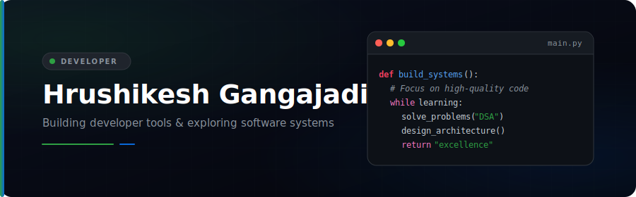
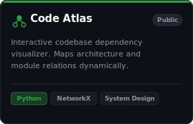
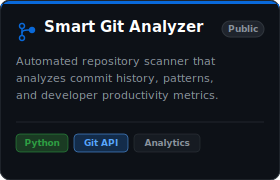
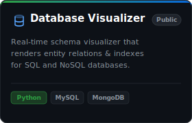

  <!-- Custom Premium Banner -->
  
  
    
  
  <!-- Interactive Typing Headline (Cursive personal style) -->
  

 

---

### ⚡ About Me

<table width="100%" border="0" cellpadding="10" cellspacing="0">
  <tr>
    <td valign="top" width="55%">
      
I'm a <strong>Computer Engineering student</strong> passionate about building developer tools and solving real software engineering problems. I enjoy learning by building, exploring system design, and creating projects that are practical, scalable, and easy to understand.

      
🌱 &nbsp;I'm currently learning <strong>Data Structures &amp; Algorithms, System Design, and Software Architecture</strong>.

      
⚡ &nbsp;Fun fact: <strong>I enjoy solving problems more than collecting certificates.</strong>

      
🎯 <strong>Career Goal:</strong> Build software that top product-based companies like Microsoft, Google, and Amazon would appreciate for its engineering quality rather than its technology stack.

    </td>
    <td valign="top" width="45%">
      <h4>🚀 Current Focus</h4>
      <ul>
        <li>📚 <strong>Data Structures &amp; Algorithms</strong></li>
        <li>🛠️ <strong>Software Engineering</strong></li>
        <li>🏗️ <strong>System Design</strong></li>
        <li>💻 <strong>Developer Tools</strong></li>
        <li>🤖 <strong>Artificial Intelligence</strong></li>
      </ul>
    </td>
  </tr>
</table>

 

---

### 🛠️ Tech Stack

<table width="100%" border="0" cellpadding="10" cellspacing="0">
  <tr>
    <td valign="top" width="33%">
      <h4>💻 Languages</h4>
      
    </td>
    <td valign="top" width="33%">
      <h4>🗄️ Databases &amp; Cloud</h4>
      
    </td>
    <td valign="top" width="33%">
      <h4>🛠️ Tools &amp; Libraries</h4>
      
    </td>
  </tr>
</table>

 

---

### 📂 Featured Projects

<table align="center" width="100%" border="0" cellpadding="5" cellspacing="0">
  <tr>
    <td align="center" width="33%">
      
    </td>
    <td align="center" width="33%">
      
    </td>
    <td align="center" width="33%">
      
    </td>
  </tr>
</table>

 

---

### 📊 GitHub Statistics

<table align="center" width="100%" border="0" cellpadding="5" cellspacing="0">
  <tr>
    <td align="center" width="50%" valign="top">
      
    </td>
    <td align="center" width="50%" valign="top">
      
    </td>
  </tr>
</table>

 

<!-- Contribution Graph (Green + Blue themed) -->

  

 

---

### 🤝 Connect with Me

  
  &nbsp;&nbsp;&nbsp;&nbsp;
  
  &nbsp;&nbsp;&nbsp;&nbsp;
  

 

---

  
Made with 💚 and code. Dedicated to software craftsmanship.

